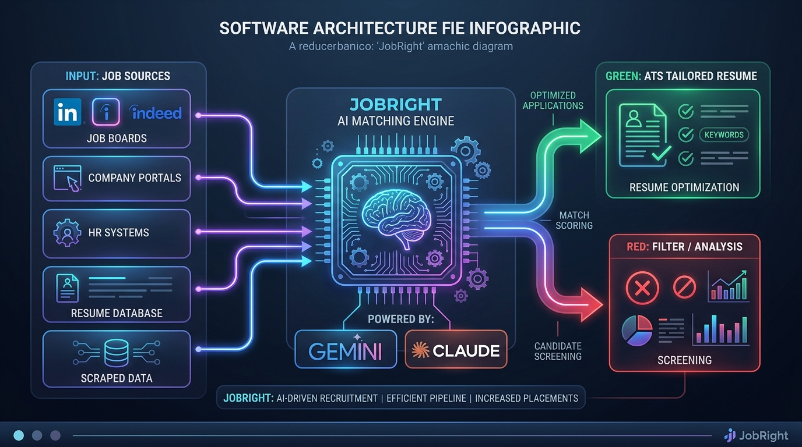

# 🎯 JobRight — Autonomous AI Job Search & Career Operations Engine

<p align="center">
  
  
  
  
</p>

<p align="center">
  <strong>Take control of your job search with a local-first, privacy-respecting AI agent.</strong><br>
  Scan job boards, evaluate JD compatibility with structured 1–5 scoring, detect ghost listings, tailor your CV with ATS precision, and manage your entire application pipeline.
</p>

---

## ⚡ Overview

Companies use automated Applicant Tracking Systems (ATS) and AI filters to screen candidates. **JobRight** levels the playing field by providing job seekers with their own private, autonomous AI career assistant. 

Running directly on your local machine, **JobRight** analyzes listings with rigorous objectivity, highlights red flags before you waste time applying, and crafts hyper-tailored application materials backed by your verified experiences.

### 🌟 Key Features

* 🔍 **Multi-Portal Job Scanning:** Deep automated scrapers for **Greenhouse**, **Lever**, **Ashby**, **Workday**, **Y-Combinator**, **a16z portfolio**, and **Hacker News (Who is Hiring)**.
* 🛡️ **Ghost Job & Repost Detection:** Algorithms detect stale postings, repetitive reposts, and phantom listings to protect your time and energy.
* 🧠 **Structured 1–5 Match Scoring (A–H Framework):**
  * **Score 1–2:** *Do Not Apply* — Identifies major skill gaps, toxic job requirements, or unrealistic compensation.
  * **Score 3:** *Conditional Apply* — Identifies areas requiring upskilling or targeted positioning.
  * **Score 4–5:** *High Priority* — Highlights direct skill alignment, team culture synergy, and strong interview odds.
* 📄 **ATS-Optimized CV & Cover Letter Generation:** Generates clean LaTeX and HTML/PDF versions of your resume with truth-verification guards.
* 📊 **Unified Application Pipeline Tracker:** CLI and TUI dashboard to monitor submission status, response latencies, and interview progression.
* 🔒 **100% Local-First & Private:** No external telemetry, no cloud lock-in, and your private data never leaves your environment.

---

## 🏗️ Architecture & Workflow

<p align="center">
  
</p>

<p align="center">
  <sub>✨ <strong>Explore Interactive System Diagram:</strong> <a href="docs/jobright-architecture.html">Open Interactive HTML ↗</a></sub>
</p>

---

## 🚀 Quick Start Guide

### 1. Prerequisites
* **Node.js** `>= 18.0.0`
* **npm** (comes with Node.js)
* **Git** installed on your system

### 2. Clone and Setup
```bash
# Clone the repository
git clone https://github.com/suryakant-source/job-right.git
cd job-right

# Install project dependencies
npm install

# Copy environment template
cp .env.example .env
```

### 3. Configure AI Models
Open `.env` in your favorite editor and configure your preferred provider:
```bash
# Option A: Google Gemini (Free tier available)
GEMINI_API_KEY=your_gemini_api_key_here

# Option B: OpenAI / OpenRouter
OPENAI_API_KEY=your_openai_api_key_here

# Option C: Local Ollama (Zero cost, no API key needed)
# Ollama runs locally on http://localhost:11434
```

### 4. Health Check
Verify your environment and dependencies:
```bash
npm run doctor
```

---

## 💻 CLI Commands & Operations

| Command | Description |
| :--- | :--- |
| `npm run doctor` | Validates environment, API keys, and local dependencies |
| `npm run scan` | Scans supported job portals for newly posted listings |
| `npm run scan:full` | Runs an exhaustive multi-portal scan (YC, a16z, Ashby, etc.) |
| `npm run tracker` | Launches the interactive application pipeline tracker |
| `npm run gemini:eval` | Runs evaluation on a target job description using Gemini |
| `npm run openai:eval` | Runs evaluation using OpenAI-compatible models |
| `npm run ollama:eval` | Runs local evaluation using Ollama models |
| `npm run pdf` | Generates pixel-perfect PDF versions of your resume |
| `npm run cv:verify-ats` | Runs ATS compliance checks on your tailored CV |
| `npm run reposts` | Identifies duplicate or reposted job listings |
| `npm run digest` | Compiles a weekly summary of pipeline activity and response rates |

---

## 🎯 The 1–5 Scoring Standard

Every job description is evaluated across an 8-factor matrix (A–H):
* **Section A:** Core Role & Technical Scope
* **Section B:** Candidate Profile Direct Match
* **Section C:** Skill & Experience Gap Analysis
* **Section D:** Red Flags, Ghost Posting Signals & Turnover Risks
* **Section E:** Compensation, Equity & Seniority Realism
* **Section F:** Strategic Resume Tailoring Angles
* **Section G:** Referral Paths & Warm Outreach Strategy
* **Section H:** Final Verdict & Concrete Action Plan

---

## 🔒 Privacy & Local-First Philosophy

* **Your data stays yours:** Your resume, work history, and job notes never get uploaded to third-party databases.
* **Direct AI Communication:** Calls to AI models are direct API requests to the provider you choose (or 100% offline with Ollama).
* **Open & Auditable:** Every line of code is open-source and reviewable on GitHub.

---

## 👨‍💻 Maintainer & Acknowledgements

* **Author & Maintainer:** **[Suryakant](https://github.com/suryakant-source)**
* **Open Source Foundations:** Built upon core patterns and open-source principles pioneered by the `career-ops` community.

---

## 📄 License

This project is licensed under the [MIT License](LICENSE) — free for private, non-commercial, and commercial use.
